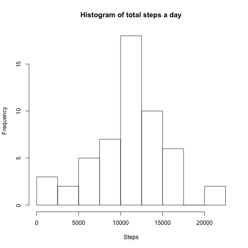
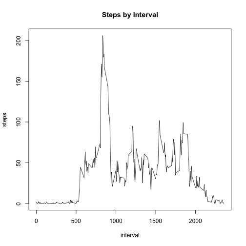
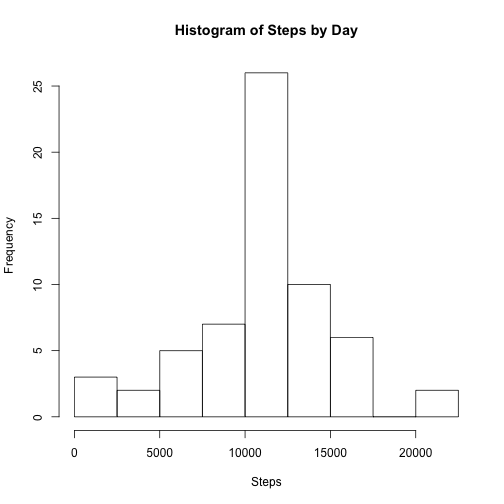
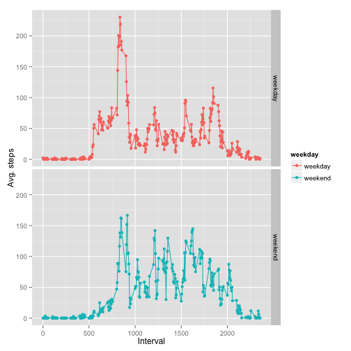

## Loading and preprocessing the data
1. First of all, we load the data...

```r
data<-read.csv(file = "activity.csv", sep = ",")
```
2. ... and proccess the "date" field as a Date:

```r
data$date<-as.Date(data$date, "%Y-%m-%d")
head(data)
```

```
##   steps       date interval
## 1    NA 2012-10-01        0
## 2    NA 2012-10-01        5
## 3    NA 2012-10-01       10
## 4    NA 2012-10-01       15
## 5    NA 2012-10-01       20
## 6    NA 2012-10-01       25
```

```r
summary(data)
```

```
##      steps             date               interval     
##  Min.   :  0.00   Min.   :2012-10-01   Min.   :   0.0  
##  1st Qu.:  0.00   1st Qu.:2012-10-16   1st Qu.: 588.8  
##  Median :  0.00   Median :2012-10-31   Median :1177.5  
##  Mean   : 37.38   Mean   :2012-10-31   Mean   :1177.5  
##  3rd Qu.: 12.00   3rd Qu.:2012-11-15   3rd Qu.:1766.2  
##  Max.   :806.00   Max.   :2012-11-30   Max.   :2355.0  
##  NA's   :2304
```
## What is mean total number of steps taken per day?

1. Calculate the total number of steps taken per day

```r
stepsbyday<-aggregate(steps ~ date, data, sum)
head(stepsbyday)
```

```
##         date steps
## 1 2012-10-02   126
## 2 2012-10-03 11352
## 3 2012-10-04 12116
## 4 2012-10-05 13294
## 5 2012-10-06 15420
## 6 2012-10-07 11015
```

2. Make a histogram of the total number of steps taken each day

```r
hist(stepsbyday$steps, xlab = "Steps", main = "Histogram of total steps a day", breaks = seq(0, 22500, by = 2500))
```

 

3. Calculate and report the mean and median of the total number of steps taken per day

```r
mean1<-mean(stepsbyday$steps, na.rm = TRUE)
mean1
```

```
## [1] 10766.19
```

```r
median1<-median(stepsbyday$steps, na.rm = TRUE)
median1
```

```
## [1] 10765
```


## What is the average daily activity pattern?

1. Make a time series plot of the 5-minute interval (x-axis) and the average number of steps taken, averaged across all days (y-axis)

```r
stepsbyinterval<-aggregate(steps ~ interval, data, mean)
plot(stepsbyinterval, type = "l", main = "Steps by Interval")
```

 

2. Which 5-minute interval, on average across all the days in the dataset, contains the maximum number of steps?

```r
stepsbyinterval$interval[stepsbyinterval$steps==max(stepsbyinterval$steps)]
```

```
## [1] 835
```

## Imputing missing values
1. Calculate and report the total number of missing values in the dataset

```r
sum(is.na(data))
```

```
## [1] 2304
```

2. Devise a strategy for filling in all of the missing values in the dataset. In this case the mean for that 5-minute intervalwill be used.

```r
fillingvals<-sapply(data$interval[is.na(data$steps)], function(x) stepsbyinterval$steps[stepsbyinterval$interval==x])
head(fillingvals)
```

```
## [1] 1.7169811 0.3396226 0.1320755 0.1509434 0.0754717 2.0943396
```

3. Create a new dataset that is equal to the original dataset but with the missing data filled in.

```r
data2<-data
data2$steps[is.na(data2$steps)]<-fillingvals
head(data2)
```

```
##       steps       date interval
## 1 1.7169811 2012-10-01        0
## 2 0.3396226 2012-10-01        5
## 3 0.1320755 2012-10-01       10
## 4 0.1509434 2012-10-01       15
## 5 0.0754717 2012-10-01       20
## 6 2.0943396 2012-10-01       25
```

4. Make a histogram of the total number of steps taken each day and Calculate and report the mean and median total number of steps taken per day. Do these values differ from the estimates from the first part of the assignment? What is the impact of imputing missing data on the estimates of the total daily number of steps?  

```r
stepsbyday2<-aggregate(steps ~ date, data2, sum)
hist(stepsbyday2$steps, xlab = "Steps", main = "Histogram of Steps by Day", breaks = seq(0, 22500, by = 2500))
```

 

```r
mean2<-mean(stepsbyday2$steps, na.rm = TRUE)
mean2
```

```
## [1] 10766.19
```

```r
mean2==mean1
```

```
## [1] TRUE
```

```r
median2<-median(stepsbyday2$steps, na.rm = TRUE)
median2
```

```
## [1] 10766.19
```

```r
median2==median1
```

```
## [1] FALSE
```
As we can see, teh mean is the same, as the values added have been calculated from the current mean values, but the median is different, as including new values, makes the middle element to change.


## Are there differences in activity patterns between weekdays and weekends?
1. Create a new factor variable in the dataset with two levels – “weekday” and “weekend” indicating whether a given date is a weekday or weekend day. In this case value "sáb" stands for "sábado(saturday)" and "dom" stands for "domingo(sunday)"

```r
data2$weekday<-ifelse(weekdays(data2$date, abbreviate = TRUE) %in% c("sáb", "dom") ,"weekend", "weekday")
head(data2)
```

```
##       steps       date interval weekday
## 1 1.7169811 2012-10-01        0 weekday
## 2 0.3396226 2012-10-01        5 weekday
## 3 0.1320755 2012-10-01       10 weekday
## 4 0.1509434 2012-10-01       15 weekday
## 5 0.0754717 2012-10-01       20 weekday
## 6 2.0943396 2012-10-01       25 weekday
```

```r
nrow(data2[data2$weekday=="weekday",])
```

```
## [1] 12960
```

```r
nrow(data2[data2$weekday=="weekend",])
```

```
## [1] 4608
```


Make a panel plot containing a time series plot (i.e. type = "l") of the 5-minute interval (x-axis) and the average number of steps taken, averaged across all weekday days or weekend days (y-axis).

```r
wd<-aggregate(steps ~ interval, data2[data2$weekday=="weekday",], mean)
wd$weekday<-"weekday"
we<-aggregate(steps ~ interval, data2[data2$weekday=="weekend",], mean)
we$weekday<-"weekend"
data3<-rbind(we,wd)

library(ggplot2)
plot<-qplot(interval,steps,data=data3,color=weekday, xlab = "Interval", ylab = "Avg. steps")
plot<-plot + facet_grid(weekday ~ .)
plot<-plot+geom_line()
plot
```

 
